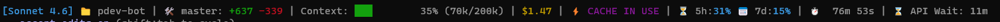

# Claude Code StatusLine: Token & Cost Monitor

A lightweight, real-time telemetry status line for Claude Code CLI.

Track token usage, cost, cache efficiency, rate limits, and coding productivity directly in your terminal, with zero overhead and clean visual feedback.



---

## Overview

Claude Code StatusLine transforms the default Claude Code status line into a compact observability layer for your sessions.

Instead of guessing what's happening under the hood, you get immediate insight into:

- Context window utilization
- Token consumption (with `k` formatting)
- Cost per session
- Cache behavior (read vs write, with savings detection)
- API rate limits (5-hour and 7-day windows)
- Lines added / removed during the session
- Total session duration and API wait time
- Current Git branch

All rendered in a single, readable line.

---

## Features

- **Real-time context bar** with visual block indicator (`█░`) and percentage
- **Token tracking** shown as `used/total` in compact `k` notation
- **Cost monitoring** in USD
- **Productivity diff** with lines added (`+`) and removed (`-`)
- **Cache state detection** with four distinct modes:
  - 💎 `MAX SAVINGS` when cache reads exceed 100k tokens
  - ⚡ `CACHE IN USE` when reading from cache
  - 💰 `WARMING CACHE` when writing to cache
  - 🔘 `EMPTY` when no cache activity
- **Dual rate-limit tracking**:
  - ⏳ 5-hour window
  - 📅 7-day window
- **Timing metrics**: total session duration and cumulative API wait time
- **Git branch detection** with 🛠️ marker
- **Adaptive color coding** for context usage and rate limits (green / yellow / red)
- **Zero dependencies** beyond `jq` and `bash`
- **Fully terminal-native** — no external services, no network calls

---

## Installation

```bash
mkdir -p ~/.claude
chmod +x ~/.claude/statusline.sh
```

Or paste the script manually:

```bash
nano ~/.claude/statusline.sh
chmod +x ~/.claude/statusline.sh
```

---

## Configuration

Add this to your `~/.claude/settings.json`:

```json
{
  "statusLine": {
    "type": "command",
    "command": "~/.claude/statusline.sh"
  }
}
```

Restart Claude Code and the status line will appear at the bottom of your session.

---

## Requirements

- `bash`
- `jq`
- Claude Code CLI
- `git` (optional, enables branch display)

---

## How It Works

The script receives Claude Code's session JSON through stdin and extracts telemetry fields with `jq`.

It then:

1. Reads model, directory, and git branch info
2. Parses context window size and used percentage
3. Aggregates input / output / cache tokens
4. Pulls 5-hour and 7-day rate-limit usage
5. Computes productivity diff (lines added / removed)
6. Detects cache mode (empty / warming / in-use / max-savings)
7. Renders a colored progress bar and emits a single status line

A snapshot of the raw input is written to `~/claude_debug.json` on every tick, which is handy for debugging or building new metrics.

No background processes. No polling. No latency.

---

## Design Philosophy

- **Zero friction**: install in seconds
- **High signal**: only actionable metrics, no filler
- **Terminal-first**: built for developers, not dashboards
- **Stateless**: no storage, no tracking, no side effects

---

## Why This Exists

Claude Code exposes a lot of useful runtime data, but it's buried inside JSON payloads most users never see.

This tool surfaces that data where it matters: directly in your workflow, every keystroke.

---

## Roadmap

- Configurable thresholds (colors, limits) via env vars
- Multi-line expanded view (optional mode)
- Per-request cost breakdown
- Plugin hooks for custom metrics
- Lightweight session history export

---

## Contributing

PRs are welcome. Keep it simple, fast, and dependency-free.

---

## License

MIT